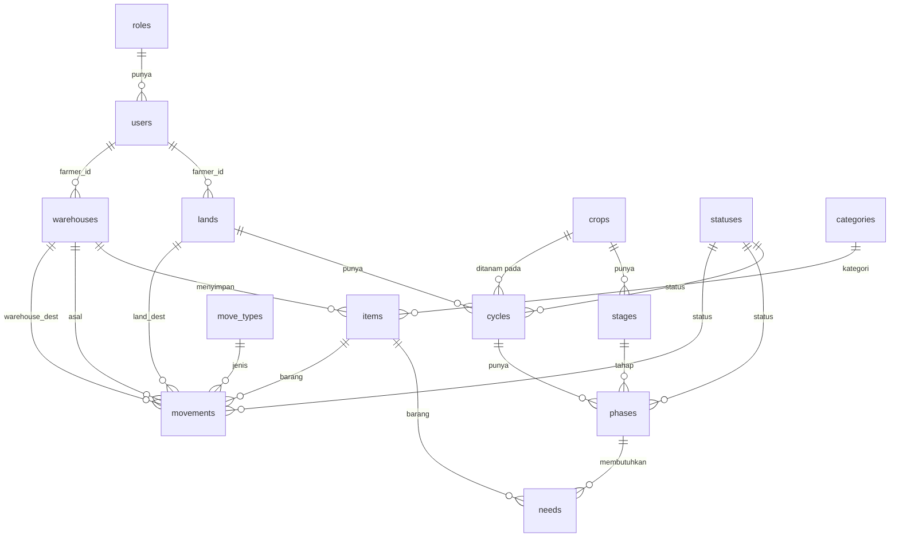

# Dokumentasi Database — AgriCloud v2

Dokumen ini menjelaskan skema database AgriCloud v2: daftar tabel, kolom, relasi antar tabel,
dan diagram ERD. Sumber kebenaran tetap berkas migration di `database/migrations/` dan model di
`app/Models/`.

| Item        | Nilai                       |
| ----------- | --------------------------- |
| DBMS        | PostgreSQL                  |
| Database    | `agricloud_v2`              |
| Host / Port | `127.0.0.1:5434` (Docker)   |
| Test DB     | `agricloud_v2_test`         |

---

## Diagram ERD

---

## Daftar Tabel

| Tabel             | Keterangan                                                        |
| ----------------- | ----------------------------------------------------------------- |
| `roles`           | Peran pengguna (mis. `admin`, `farmer`).                          |
| `users`           | Akun pengguna sistem.                                             |
| `lands`           | Lahan milik petani (farmer).                                      |
| `crops`           | Master/template tanaman.                                          |
| `stages`          | Tahapan pertumbuhan per tanaman.                                  |
| `statuses`        | Status umum (dipakai cycle, phase, movement).                     |
| `cycles`          | Siklus tanam pada satu lahan untuk satu tanaman.                  |
| `phases`          | Fase berjalan dalam satu siklus, mengacu ke tahapan tanaman.      |
| `warehouses`      | Gudang milik petani.                                              |
| `categories`      | Kategori barang.                                                  |
| `items`           | Barang/stok yang disimpan di gudang.                             |
| `move_types`      | Jenis pergerakan barang (mis. `IN`, `OUT`, `TRANSFER`).          |
| `movements`       | Catatan pergerakan/logistik barang.                              |
| `needs`           | Kebutuhan barang pada suatu fase tanam.                          |

> Tabel bawaan framework: `password_reset_tokens`, `sessions`, `cache`, `jobs`,
> `personal_access_tokens` (Sanctum). Tidak dirinci di sini.

---

## Detail Kolom

### `roles`

| Kolom        | Tipe        | Keterangan          |
| ------------ | ----------- | ------------------- |
| `id`         | bigint, PK  | —                   |
| `name`       | string, unik| Nama peran.         |
| `timestamps` | timestamp   | `created/updated`.  |

### `users`

| Kolom               | Tipe              | Keterangan                          |
| ------------------- | ----------------- | ----------------------------------- |
| `id`                | bigint, PK        | —                                   |
| `name`              | string            | Nama pengguna.                      |
| `role_id`           | FK → `roles`      | Peran. `cascadeOnDelete`.           |
| `profil_url`        | string, nullable  | URL foto profil.                    |
| `phone_number`      | string, unik      | Nomor telepon.                      |
| `email`             | string, unik      | Email.                              |
| `email_verified_at` | timestamp, null   | Waktu verifikasi email.             |
| `password`          | string (hashed)   | Kata sandi.                         |
| `remember_token`    | string            | Token "remember me".                |
| `timestamps`        | timestamp         | —                                   |

### `lands`

| Kolom         | Tipe              | Keterangan                       |
| ------------- | ----------------- | -------------------------------- |
| `id`          | bigint, PK        | —                                |
| `farmer_id`   | FK → `users`      | Pemilik. `cascadeOnDelete`.      |
| `name`        | string            | Nama lahan.                      |
| `image_url`   | text, nullable    | URL gambar.                      |
| `description` | text, nullable    | Deskripsi.                       |
| `latitude`    | decimal(10,7), null | Koordinat lintang.             |
| `longitude`   | decimal(10,7), null | Koordinat bujur.               |
| `area`        | decimal(8,2), null  | Luas lahan.                    |
| `timestamps`  | timestamp         | —                                |

### `crops`

| Kolom         | Tipe           | Keterangan      |
| ------------- | -------------- | --------------- |
| `id`          | bigint, PK     | —               |
| `name`        | string         | Nama tanaman.   |
| `description` | text, nullable | Deskripsi.      |
| `image_url`   | text, nullable | URL gambar.     |
| `timestamps`  | timestamp      | —               |

### `stages`

| Kolom           | Tipe          | Keterangan                         |
| --------------- | ------------- | ---------------------------------- |
| `id`            | bigint, PK    | —                                  |
| `crop_id`       | FK → `crops`  | Tanaman. `cascadeOnDelete`.        |
| `name`          | string        | Nama tahapan.                      |
| `order`         | integer       | Urutan tahapan (default `1`).      |
| `duration_days` | integer, null | Durasi tahapan (hari).             |
| `timestamps`    | timestamp     | —                                  |

### `statuses`

| Kolom        | Tipe           | Keterangan                              |
| ------------ | -------------- | --------------------------------------- |
| `id`         | bigint, PK     | —                                       |
| `name`       | string         | Nama status.                            |
| `type`       | string, null   | Konteks: `phase`, `cycle`, `movement`.  |
| `timestamps` | timestamp      | —                                       |

### `cycles`

| Kolom         | Tipe              | Keterangan                          |
| ------------- | ----------------- | ----------------------------------- |
| `id`          | bigint, PK        | —                                   |
| `land_id`     | FK → `lands`      | Lahan. `cascadeOnDelete`.           |
| `crop_id`     | FK → `crops`      | Tanaman. `cascadeOnDelete`.         |
| `status_id`   | FK → `statuses`, null | Status. `nullOnDelete`.         |
| `name`        | string            | Nama siklus.                        |
| `description` | text, nullable    | Deskripsi.                          |
| `start_date`  | date, nullable    | Tanggal mulai.                      |
| `end_date`    | date, nullable    | Tanggal selesai.                    |
| `timestamps`  | timestamp         | —                                   |

### `phases`

| Kolom        | Tipe                  | Keterangan                       |
| ------------ | --------------------- | -------------------------------- |
| `id`         | bigint, PK            | —                                |
| `cycle_id`   | FK → `cycles`         | Siklus. `cascadeOnDelete`.       |
| `stage_id`   | FK → `stages`         | Tahapan. `cascadeOnDelete`.      |
| `status_id`  | FK → `statuses`, null | Status. `nullOnDelete`.          |
| `started_at` | date, nullable        | Waktu mulai fase.                |
| `ended_at`   | date, nullable        | Waktu selesai fase.              |
| `timestamps` | timestamp             | —                                |

### `warehouses`

| Kolom         | Tipe             | Keterangan                    |
| ------------- | ---------------- | ----------------------------- |
| `id`          | bigint, PK       | —                             |
| `farmer_id`   | FK → `users`     | Pemilik. `cascadeOnDelete`.   |
| `name`        | string           | Nama gudang.                  |
| `image_url`   | string, nullable | URL gambar.                   |
| `description` | string, nullable | Deskripsi.                    |
| `location`    | string, nullable | Lokasi.                       |
| `timestamps`  | timestamp        | —                             |

### `categories`

| Kolom        | Tipe       | Keterangan      |
| ------------ | ---------- | --------------- |
| `id`         | bigint, PK | —               |
| `name`       | string     | Nama kategori.  |
| `timestamps` | timestamp  | —               |

### `items`

| Kolom          | Tipe                   | Keterangan                       |
| -------------- | ---------------------- | -------------------------------- |
| `id`           | bigint, PK             | —                                |
| `warehouse_id` | FK → `warehouses`      | Gudang. `cascadeOnDelete`.       |
| `category_id`  | FK → `categories`, null | Kategori. `nullOnDelete`.      |
| `name`         | string                 | Nama barang.                     |
| `unit`         | string                 | Satuan (mis. kg, liter).         |
| `stock`        | integer                | Jumlah stok (default `0`).       |
| `timestamps`   | timestamp              | —                                |

### `move_types`

| Kolom        | Tipe         | Keterangan                          |
| ------------ | ------------ | ----------------------------------- |
| `id`         | bigint, PK   | —                                   |
| `name`       | string       | Nama jenis.                         |
| `code`       | string, unik | Kode (mis. `IN`, `OUT`, `TRANSFER`).|
| `timestamps` | timestamp    | —                                   |

### `movements`

| Kolom            | Tipe                    | Keterangan                                  |
| ---------------- | ----------------------- | ------------------------------------------- |
| `id`             | bigint, PK              | —                                           |
| `warehouse_id`   | FK → `warehouses`, null | Gudang asal. `cascadeOnDelete`.             |
| `item_id`        | FK → `items`            | Barang. `cascadeOnDelete`.                  |
| `movetype_id`    | FK → `move_types`       | Jenis pergerakan. `cascadeOnDelete`.        |
| `status_id`      | FK → `statuses`, null   | Status. `nullOnDelete`.                     |
| `land_dest`      | FK → `lands`, null      | Lahan tujuan. `nullOnDelete`.               |
| `warehouse_dest` | FK → `warehouses`, null | Gudang tujuan. `nullOnDelete`.              |
| `quantity`       | decimal(12,4)           | Jumlah.                                     |
| `note`           | text, nullable          | Catatan.                                    |
| `timestamps`     | timestamp               | —                                           |

### `needs`

| Kolom             | Tipe          | Keterangan                       |
| ----------------- | ------------- | -------------------------------- |
| `id`              | bigint, PK    | —                                |
| `phase_id`        | FK → `phases` | Fase. `cascadeOnDelete`.         |
| `item_id`         | FK → `items`  | Barang. `cascadeOnDelete`.       |
| `quantity_needed` | integer       | Jumlah yang dibutuhkan.          |
| `timestamps`      | timestamp     | —                                |

---

## Ringkasan Relasi

| Model        | Relasi                                                                       |
| ------------ | ---------------------------------------------------------------------------- |
| `Role`       | hasMany `User`                                                               |
| `User`       | belongsTo `Role`; hasMany `Land` (farmer_id), `Warehouse` (farmer_id)        |
| `Land`       | belongsTo `User` (farmer_id); hasMany `Cycle`, `Movements` (land_dest)       |
| `Crop`       | hasMany `Cycle`, `Stage`                                                     |
| `Stage`      | belongsTo `Crop`; hasMany `Phase`                                            |
| `Status`     | hasMany `Movements`, `Cycle`, `Phase`                                        |
| `Cycle`      | belongsTo `Land`, `Crop`, `Status`; hasMany `Phase`                          |
| `Phase`      | belongsTo `Cycle`, `Stage`, `Status`; hasMany `Needs`                        |
| `Warehouse`  | belongsTo `User` (farmer_id); hasMany `Items`, `Movements`                   |
| `Categories` | hasMany `Items`                                                              |
| `Items`      | belongsTo `Warehouse`, `Categories`; hasMany `Movements`, `Needs`            |
| `MoveTypes`  | hasMany `Movements`                                                          |
| `Movements`  | belongsTo `Warehouse`, `Items`, `MoveTypes`, `Status`, `Land` (land_dest), `Warehouse` (warehouse_dest) |
| `Needs`      | belongsTo `Phase`, `Items`                                                   |

---

## Referensi

- Migration: `database/migrations/`
- Model & relasi: `app/Models/`
- Dokumentasi API: [`docs/API.md`](API.md)
